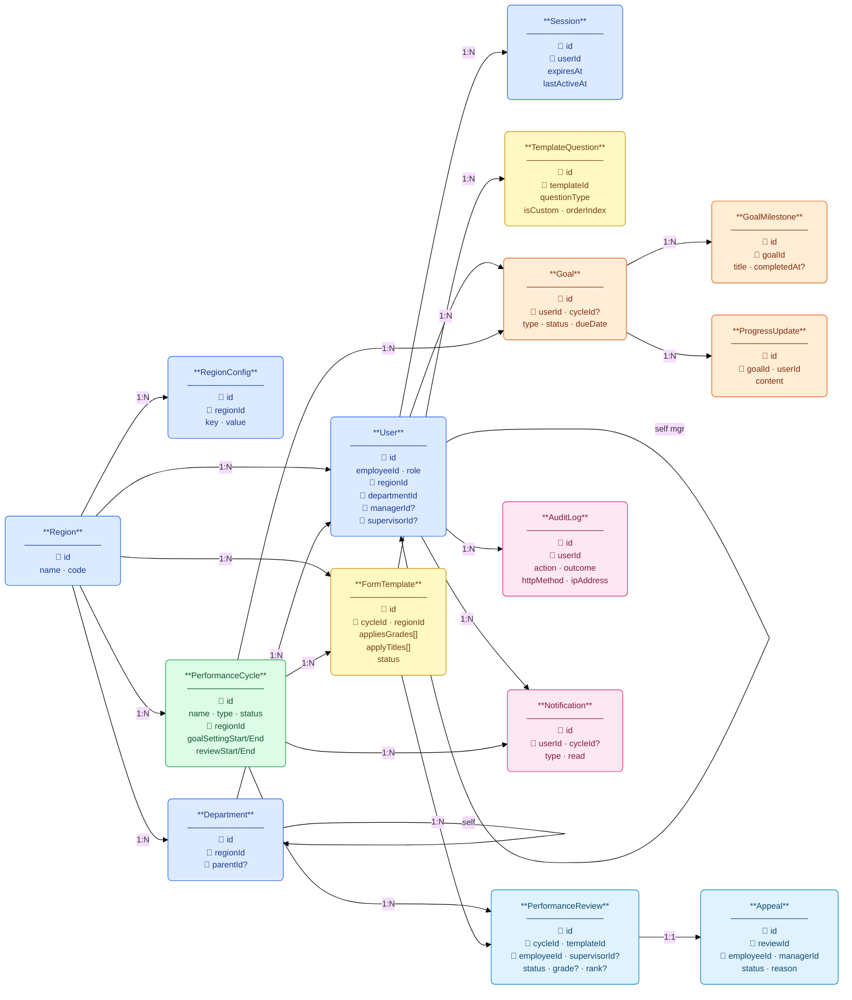

# PMS — Schema Design Decisions

## ER Diagram




## 概覽

本文件記錄 `schema.prisma` 的設計決策，以及與原始 Spec 的差異與取捨。

---

## Region

### 決策
- 獨立 `Region` 表，欄位：`id`、`name`（唯一）、`code`（唯一，e.g. `TW`、`NA`）
- 種子資料：Global / Taiwan / North America / Japan / Europe

### 與 Spec 差異
- Spec 使用 `country_code`；本實作改用 `code`，語意相同（TW = Taiwan）
- `Region.code` 較短、適合 UI 顯示，`Region.name` 用於人類可讀標籤

---

## RegionConfig

### 決策
- 獨立 `RegionConfig` 表，以 `(regionId, key)` 唯一鍵儲存各地區政策設定
- `key` 為字串（e.g. `appeal_window_days`）、`value` 為字串（所有型別統一序列化）、`label` 供 UI 顯示
- `@@unique([regionId, key])` 確保同一地區同一 key 不重複

### 種子資料範例

| Region | Key | Value |
|--------|-----|-------|
| TW | `appeal_window_days` | `7` |
| TW | `grade_distribution_required` | `true` |
| JP | `appeal_window_days` | `14` |
| JP | `overtime_policy` | `"fixed"` |
| EU | `gdpr_data_retention_days` | `365` |

### API
- `GET /config` — 取得本 region 所有設定（RegionalHR 限本地區；Admin/GlobalHR 可指定 regionId）
- `PATCH /config/:key` — 更新單一設定值

---

## Department

### 決策
- 獨立 `Department` 表，支援兩層父子結構（`parentId` self-reference）
- `@@unique([name, regionId])`：同一 region 內部門名稱不重複；跨 region 可同名
- 種子資料：Engineering / Human Resources 等，含子部門（Process Engineering, Equipment Engineering, Recruiting）

### 簡化說明
- Spec 設計三層（部門 → 子部門 → 小組），此版僅實作兩層
- 資料庫結構已支援任意深度；種子只填兩層，待業務需要再擴充
- 目前不實作遞迴樹查詢，UI 若需要完整樹再加

---

## User

### FK 欄位
- `regionId` → `Region.id`（NOT NULL）
- `departmentId` → `Department.id`（NOT NULL）
- 移除舊的 `region String` 和 `department String` 欄位

### SessionUser
- 後端 `SessionUser` 帶 `regionId`（FK）和 `region`（name 字串）雙欄，方便：
  - 服務層直接用 ID 做 FK 篩選（效率高）
  - 顯示層和前端接收 name 字串（相容舊介面）

---

## PerformanceCycle

### 決策
- 改用 `regionId String`（FK → `Region.id`），每個 Cycle 隸屬單一地區
- 舊版設計 `regions String[]`（region name 字串陣列）已廢棄

### 改版理由
- 一個 Cycle 對應一個地區，資料模型更清晰，可直接 JOIN 做地區篩選
- 不需要 `hasSome`/`has` 查詢，FK 索引效率更高
- 若未來需要跨地區共用 Cycle，再考慮 junction table

### CycleStatus 狀態機（6 步）

| 狀態 | 前端顯示 | 觸發動作 |
|------|----------|----------|
| `GoalSetting` | 目標設定 | 初始狀態 |
| `InProgress` | 執行中 | HR 手動推進 |
| `EmployeeReview` | 員工自評 | HR 推進；系統自動建立 PerformanceReview |
| `SupervisorReview` | 主管初評 | HR 手動推進 |
| `Calibration` | 校準發布 | HR 手動推進 |
| `Completed` | 已完成 | HR 手動推進 |

推進到 `EmployeeReview` 時自動建立 PerformanceReview：找出該地區所有 Employee，對每人匹配一份 `Published` 模板（`appliesGrades` 包含 `jobLevel` **且** `applyTitles` 包含 `jobTitle`）。

---

## FormTemplate

### FK 欄位
- `regionId` → `Region.id`（NOT NULL）
- 移除舊的 `region String`

### 多選陣列
- `appliesGrades String[]`（原 `appliesGrade String`）
- `applyTitles String[]`（原 `appliesTitle String`）
- 選項來源：後端 `GET /users/job-levels` 和 `GET /users/job-titles`，從現有 User 資料 DISTINCT 查詢

### 理由
- 一份模板常需同時對多個職等/職稱生效（e.g. L2 + L3 工程師共用同一份表）
- 從 DB 動態取選項 → 不需維護硬編碼清單，新增員工後自動反映

---

## TemplateQuestion

### `scopeDepartmentId`
- `null` → HR 公版題（所有部門可見）
- 有值 → 該 Manager 為自己部門加的自訂題
- 儲存 `Department.id`（FK），不再儲存部門名稱字串

### `isCustom` / `isGlobal`
- `isCustom = false`：HR 建立的公版題
- `isCustom = true`：Manager 為部門新增的自訂題
- `isGlobal = true`：Admin 鎖定，任何地區 HR 均不得刪除

---

## User — 自我關聯（Manager / Supervisor）

### 決策
- `managerId String?` → 只設在 **Supervisor** 身上，指向其上級 Manager
- `supervisorId String?` → 只設在 **Employee** 身上，指向其直屬 Supervisor
- Manager 可由鏈推導：`employee.supervisor.managerId`，Employee 不重複存 `managerId`
- 兩條關係各用具名字串（`"UserManager"` / `"UserSupervisor"`）以避免 Prisma 多重 self-relation 衝突
- `onDelete: SetNull`：主管離職後不刪除下屬，下屬的 FK 設為 null

### 邊界情況：直屬員工（無 Supervisor）
若某員工直接匯報給 Manager（不經過 Supervisor）：
- `managerId = manager.id`（例外地設在 Employee 身上）
- `supervisorId = null`
- 查詢時以 OR 同時涵蓋兩條路徑：
  ```ts
  OR: [
    { employee: { supervisor: { managerId: user.id } } }, // 一般路徑
    { employee: { managerId: user.id, supervisorId: null } }, // 直屬路徑
  ]
  ```

### 種子資料層級（Taiwan 為例）
```
Manager(tw-mgr001)
  ├── Supervisor(tw-sup001) [managerId=tw-mgr001]
  │   ├── Employee(tw-emp001) [supervisorId=tw-sup001]
  │   └── Employee(tw-emp004) [supervisorId=tw-sup001]
  └── Supervisor(tw-sup002) [managerId=tw-mgr001]
      └── Employee(tw-emp002) [supervisorId=tw-sup002]

RegionalHR(tw-hr001)
  └── Supervisor(tw-sup003) [managerId=tw-hr001]
      └── Employee(tw-emp003) [supervisorId=tw-sup003]
```

---

## Goal

### 決策
- `cycleId String?`：目前 nullable，允許員工先建立目標、等週期開始後再關聯
- SMART 欄位映射：`description`（Specific）、`metric`（Measurable）、`targetValue`（Achievable）、`relevance`（Relevant）、`dueDate`（Time-bound）
- `status GoalStatus @default(Draft)`：Draft → PendingApproval → Approved → Completed
- `type GoalType @default(Personal)`：Personal / Team

### 審核流程
- Employee 提交（`PATCH /goals/:id/submit`）→ status 變 `PendingApproval`
- Supervisor 核准（`PATCH /goals/:id/approve`）→ status 變 `Approved`
- Supervisor 退回（`PATCH /goals/:id/reject`）→ status 退回 `Draft`

### 進度計算（前端邏輯）
- 有里程碑時：`completedCount / totalCount * 100`
- 無里程碑時：status 對應固定百分比（Draft=0, PendingApproval=30, Approved=65, Completed=100）

---

## GoalMilestone

### 決策
- 屬於 Goal 的條列式子任務，`orderIndex Int` 控制順序
- `completedAt DateTime?`：null = 未完成；有值 = 完成時間
- `note String?`：完成時附加的備注，只在 complete 動作時儲存，取消完成時清空
- `url String?`：里程碑附加連結（佐證文件、外部 ticket 等）
- `onDelete: Cascade`：Goal 刪除時所有里程碑一起刪

### Toggle 行為（前端 UX）
1. 第一次點擊未完成的里程碑 → 顯示備注輸入框
2. 按「完成」送出（或略過備注）→ `PATCH /goals/:id/milestones/:mid`，`body: { note? }`
3. 點擊已完成的里程碑 → 直接 uncomplete（`completedAt` 清空、`note` 清空）

### Reorder 設計
- 端點：`PUT /goals/:id/milestones/reorder`，body `{ ids: string[] }`（完整排序後的 ID 陣列）
- 使用 `$transaction` 批次更新所有 `orderIndex`（index 0 = 第一筆）
- 前端用 HTML5 DnD，不依賴額外函式庫
- 拖拉結束後重算陣列順序再呼叫 API，送完後 `refetch()`（不做樂觀更新）

---

## ProgressUpdate

- 自由文字進度記錄，`userId` 記錄是誰填的
- `onDelete: Cascade`：隨 Goal 一起刪
- 注意：目標詳情頁目前以里程碑取代自由文字更新，`progressUpdates` 欄位保留但 UI 未顯示

---

## Session

- 保留 Session table（不使用 JWT）
- TTL 8 小時，閒置登出（30 分鐘）尚未實作

---

## PerformanceReview

### 決策
- `employeeAnswers Json`、`supervisorAnswers Json`：`[{ questionId, answer }]` 陣列，不拆子表（題目順序 / 內容以 FormTemplate 為準）
- `grade ReviewGrade?`：由主管填寫，經理可在發布前調整
- `rank Int?`：經理校準排名時填入，同分組比較用
- 答案存 JSON 的理由：題目可能隨版本不同，不用 FK 關聯；審計時快照即答案

### 評核自動建立
- 觸發點：`CycleStatus` 推進到 `EmployeeReview` 時
- 匹配邏輯：找出 cycle region 內所有 Employee，對每人找一份 `Published` 模板，條件 `appliesGrades` 包含 `user.jobLevel` **且** `applyTitles` 包含 `user.jobTitle`
- 若無匹配模板 → 跳過該員工（不報錯，但記錄 log）
- `supervisorId` = `user.supervisorId`（直屬 Supervisor；若員工直接匯報 Manager 則為 null）

### 等第制度（對應 TSMC 實際制度）
- `O`（Outstanding）、`S_Plus`（S+）、`S`、`S_Minus`（S-）、`I`（Improvement needed）、`U`（Unacceptable）
- 前端顯示：`S_Plus` → `S+`，`S_Minus` → `S-`（Prisma enum 不支援特殊字元）

### 草稿機制
- 「草稿」不是獨立 status，而是「在自己那一輪尚未送出」
  - 員工 status = `PendingEmployeeSubmit` → 可反覆 PUT answers
  - 主管 status = `PendingSupervisorReview` → 可反覆 PUT supervisor fields
- 送出 = 呼叫 submit endpoint，status 推進，之後該欄位鎖定

---

## Appeal

### 決策
- `reviewId String @unique`：一份評核最多一個申訴
- `managerId`：申訴的受理人（通常是 Employee 所在 region 的 Manager）
- `status AppealStatus`：`Pending` → `Resolved`
- `managerResponse String?`：Manager 回覆內容，Resolved 時必填
- `resolvedAt DateTime?`：結案時間戳

---

## AuditLog（Neon PostgreSQL，Prisma model）

Audit Log 存於 PostgreSQL `AuditLog` 表，透過 Prisma ORM 寫入。

### 欄位結構

| 欄位 | 型別 | 說明 |
|------|------|------|
| `id` | String (UUID) | 主鍵 |
| `userId` | String | 操作者 UUID |
| `userName` | String | 操作者姓名 |
| `userRegionId` | String? | 操作者地區 UUID（RegionalHR 篩選用） |
| `action` | String | 操作代碼（e.g. `GOAL_SUBMIT`、`LOGIN`） |
| `outcome` | String | `SUCCESS` 或 `FORBIDDEN` |
| `resource` | String | 資源類型（e.g. `goal`、`review`） |
| `resourceId` | String? | 資源 UUID |
| `httpMethod` | String? | `GET`、`POST`、`PUT` 等 |
| `httpPath` | String? | 請求路徑（e.g. `/auth/login`） |
| `httpStatus` | Int? | HTTP 狀態碼 |
| `ipAddress` | String? | 客戶端 IP |
| `userAgent` | String? | 瀏覽器 UA |
| `detail` | Json? | 請求 body 快照（passwords/tokens 已清除） |
| `createdAt` | DateTime | 建立時間（indexed） |

### Index
`@@index([createdAt])`、`@@index([userId])`、`@@index([outcome])`、`@@index([resource])`

### 寫入來源
1. **AuditWriteInterceptor**：攔截所有 POST/PUT/PATCH/DELETE，成功後寫入
2. **ForbiddenExceptionFilter**：攔截 403，寫入 `outcome: FORBIDDEN`
3. **AuthService.login() / logout()**：手動呼叫 `audit.log()`

### 讀取權限
- `GET /audit`：限 Admin、GlobalHR、RegionalHR
- RegionalHR 自動以 `userRegionId = user.regionId` 過濾，只看本地區紀錄

---

## 未實作（刻意跳過）

| 項目 | 說明 |
|------|------|
| Department 三層遞迴 | Schema 支援任意深度，查詢與 UI 尚未實作 |
| PerformanceCycle 跨地區共用 | 目前每個 Cycle 對應單一 Region |
| Goal cycleId 關聯 UI | 欄位已預留，待週期選擇介面補上 |
| Session 閒置登出 | ✅ 已實作：後端 `lastActiveAt` + 前端 `IdleWatcher` 30 分鐘自動登出 |
| ProgressUpdate UI | 欄位保留，UI 以里程碑取代，自由文字進度頁未顯示 |
